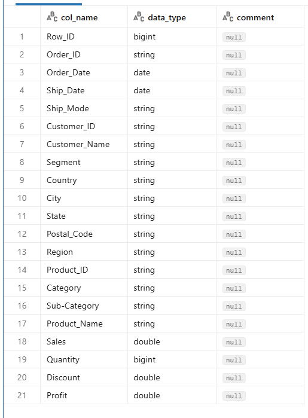
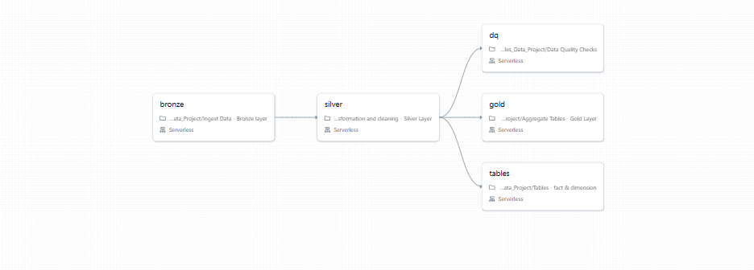
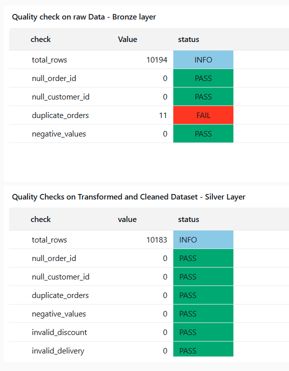

# Sales Data Pipeline using Databricks with CI/CD Integration
---

## Project Overview

This project implements an **end-to-end data engineering pipeline** using Databricks, following the **Medallion Architecture (Bronze → Silver → Gold)**.

This pipeline ingests raw retail sales data, applies transformations and quality checks, and produces analytics-ready datasets—all orchestrated through Databricks Jobs and deployed automatically on every push to main.

---

## Dataset Description

The dataset represents **retail sales transactions**, containing:

* Order details (Order ID, Order Date, Ship Date)
* Customer information (Customer ID, Segment, Region)
* Product details (Category, Sub-category)
* Sales metrics (Sales, Quantity, Discount, Profit)

```markdown

```

## Architecture
Medallion Layers
```markdown
(images/MedallionArchitecture.png)
```
```text
Source Data → Bronze Layer → Silver Layer → Data Quality Checks → Gold Layer → Dashboard
```

## Technology Stack

* Databricks (PySpark, Delta Lake)
* Python
* SQL
* GitHub (Version Control)
* GitHub Actions (CI/CD)
* Data Engineering Concepts (ETL, Data Modeling)

---

## Project Structure

```
databricks-sales-pipeline/
│
├── Notebooks/
│   ├── Ingest Data - Bronze layer.ipynb
│   ├── Transformation and cleaning - Silver Layer.ipynb
│   ├── Data Quality Checks.ipynb
│   ├── Tables - fact & dimension.ipynb
│   └── Aggregate Tables - Gold Layer.ipynb
│
├── job/
│   └── jobs.json
│
├── .github/workflows/
│   └── main.yml
│
└── README.md
```

---

##  End-to-End Pipeline Flow

### Step 1: Data Ingestion (Bronze Layer)

* Raw data is loaded into Delta tables
* No heavy transformation applied
* Serves as the source of truth

---

### Step 2: Data Transformation (Silver Layer)

* Data cleaning and preprocessing
* Schema standardization
* Derived columns added:

  * `delivery_days`
  * `delivery_type` (1-day, fast, delayed)

---

### Step 3: Data Quality Checks

* Validation rules applied on both Bronze and Silver layers
* Ensures reliability before downstream usage

---

### Step 4: Data Modeling

* Creation of Fact and Dimension tables
* Enables structured analytics

---

### Step 5: Gold Layer (Analytics)

* Aggregated tables for reporting
* Business insights generation

---

## Workflow Pipeline (Databricks Jobs)

The pipeline is orchestrated using a **multi-task workflow**:

```
Bronze → Silver → Data Quality → Tables → Gold
```

```markdown

```

---

## Data Quality Framework

Validation checks run on both Bronze and Silver layers before downstream processing:

* Null validation : Order ID, Customer ID are required
* Duplicate detection	: Identifies and flags duplicate records
* Negative values	: Validates Sales, Quantity, Profit
* Invalid discounts	: Ensures discount values within valid range
* Delivery calculations	: Validates delivery date logic
---

```markdown

```

### Key Observations: 

* Duplicate records detected in raw data and handled during cleaning
* All checks passed in cleaned dataset
* Data consistency improved after transformations

---

## Transformations Applied

* Removed duplicate records
* Handled null values
* Standardized date formats
* Derived delivery metrics
* Validated business rules

---

## 📊 Data Model

### Fact Table

* Sales metrics: Sales, Quantity, Profit

### Dimension Tables

* Customer
* Product
* Geography
* Date

---

## Analytics Capabilities

The Gold layer enables:

* Monthly/yearly sales trends
* Customer segmentation analysis
* Regional performance comparisons
* Delivery efficiency metrics

---

## CI/CD Implementation

### Trigger : 

* Executes on every push to `main` branch

### Flow

1. Code pushed to GitHub
2. CI/CD pipeline triggered
3. Databricks CLI configured using secrets
4. Notebooks deployed to workspace
5. Existing job updated
6. Pipeline executed after deployment

---

## GitHub Secrets

* `DATABRICKS_HOST`
* `DATABRICKS_TOKEN`

---

## Skills Demonstrated

* Data Engineering (ETL Pipeline Design)
* PySpark Transformations
* Data Modeling (Fact & Dimension Tables)
* Data Quality Validation
* Workflow Orchestration
* CI/CD Implementation
* Git & Version Control
* Problem Solving & Debugging

---

## Getting started 

1. Clone the repository
2. Configure Databricks credentials as GitHub secrets
3. Push to main to trigger deployment, or import notebooks manually
4. Run the workflow job in Databricks
5. Query the Gold layer tables for analytics

---

## Future Enhancements

* Incremental loading using MERGE
* Partitioning optimization
* Monitoring & logging layer
* Integration with BI tools (Power BI)
* Data Visualization with Aggregate Tables*

---

