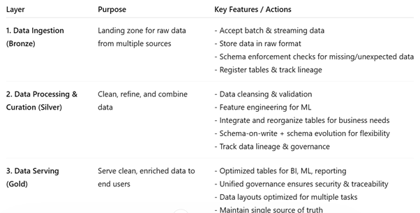
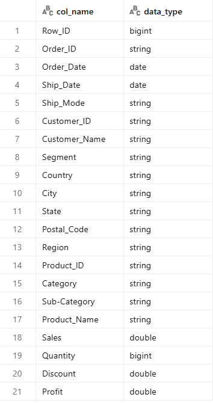

# Sales Data Pipeline using Databricks & CI/CD


##  Overview
An **end-to-end data engineering pipeline** using Databricks, following the **Medallion Architecture**.
The pipeline ingests raw retail sales data, applies transformations and quality checks, and produces analytics-ready datasets—all orchestrated through Databricks Jobs and deployed automatically on every push to main.


### Key Highlights

- End-to-end ETL pipeline using Databricks
- Implemented Medallion Architecture (Bronze, Silver, Gold)
- Built data quality framework with validation reporting
- Automated deployment using CI/CD (GitHub Actions)
- Designed scalable and modular pipeline

## Technology Stack

* Databricks (PySpark, Delta Lake)
* Python
* SQL
* GitHub (Version Control)
* GitHub Actions (CI/CD)
* Data Engineering Concepts (ETL, Data Modeling)

## Project Structure
```
databricks-sales-pipeline/
│
├── Notebooks/
│   ├── Ingest Data - Bronze layer.ipynb
│   ├── Transformation and cleaning - Silver Layer.ipynb
│   ├── Data Quality Checks.ipynb
│   ├── Tables - fact & dimension.ipynb
│   └── Aggregate Tables - Gold Layer.ipynb
│
├── job/
│   └── jobs.json
│
├── .github/workflows/
│   └── main.yml
│
└── README.md
```


## Architecture
```text
Source Data → Bronze Layer → Silver Layer → Data Quality Checks → Gold Layer 
```
**Medallion Architecture**

The pipeline is designed using a layered architecture to ensure:

- Data traceability : `Bronze` retains raw data
- Data reliability : `Silver` ensures clean data
- Performance optimization : `Gold` supports analytics

Each layer has a clear responsibility, reducing complexity and improving maintainability.

<p align="center">
  
</p>


## Dataset 

The dataset represents **retail sales transactions**, containing:

* Order details (Order ID, Order Date, Ship Date)
* Customer information (Customer ID, Segment, Region)
* Product details (Category, Sub-category)
* Sales metrics (Sales, Quantity, Discount, Profit)


<p align="center">
  
</p>


##  Pipeline Flow

### Step 1: Data Ingestion (Bronze Layer)

* Raw data is loaded into Delta tables
* No heavy transformation applied
* Serves as the source of truth


### Step 2: Data Transformation (Silver Layer)

* Data cleaning and preprocessing
* Schema standardization
* Derived columns added:

  * `delivery_days`
  * `delivery_type` (1-day, fast, delayed)


### Step 3: Data Quality Checks

* Validation rules applied on both Bronze and Silver layers
* Ensures reliability before downstream usage


### Step 4: Data Modeling

* Creation of Fact and Dimension tables
* Enables structured analytics


### Step 5: Analytics (Gold Layer)

* Aggregated tables for reporting
* Business insights generation


## Workflow Orchestration (Databricks Jobs)

The pipeline is orchestrated using Databricks Jobs, implementing a `Directed Acyclic Graph (DAG)` to manage task dependencies and execution flow.

Pipeline Flow
```
Bronze → Silver → (Data Quality, Tables, Gold)
```
<p align="center">
  
</p>

### Pipeline Features
* Each task runs as an independent notebook ensures modularity and scalability
* Tasks execute in a dependency-driven sequence

  if a task fails downstream tasks are skipped, which prevents propagation of incorrect data
* Parallel execution is enabled after Silver layer for faster execution

* Visual DAG view in Databricks is available along with Task-level logs and execution status for monitoring.

## Data Quality Framework

Validation checks run on both Bronze and Silver layers before downstream processing:

* Null validation : Order ID, Customer ID are required
* Duplicate detection	: Identifies and flags duplicate records
* Negative values	: Validates Sales, Quantity, Profit
* Invalid discounts	: Ensures discount values within valid range
* Delivery calculations	: Validates delivery date logic


<p align="center">
  
</p>


### Key Observations: 

* Duplicate records detected in raw data and handled during cleaning
* All checks passed in cleaned dataset
* Data consistency improved after transformations


### Transformations Applied

* Removed duplicate records
* Handled null values
* Standardized date formats
* Derived delivery metrics
* Validated business rules


## Data Model

### Fact Table

* Sales metrics: Sales, Quantity, Profit

### Dimension Tables

* Customer
* Product
* Geography
* Date


## Analytics Capabilities

The Gold layer enables:

* Monthly/yearly sales trends
* Customer segmentation analysis
* Regional performance comparisons
* Delivery efficiency metrics


## CI/CD Pipeline (Github Actions)

Implemented an automated CI/CD pipeline to ensure seamless deployment.

### Flow

1. Code pushed to GitHub
2. CI/CD pipeline triggered
3. Databricks CLI configured using secrets
4. Notebooks deployed to workspace
5. Existing job updated
6. Pipeline executed after deployment


### Key Features:
- Auto-trigger on code push to `main` branch
- Automated notebook deployment to `Databricks`
- Job configuration updated dynamically
- Eliminates manual deployment effort

### Benefits:
- Faster development cycles
- Reduced human error
- Consistent environment setup

## Getting started 

1. Clone the repository
2. Configure Databricks credentials as GitHub secrets
3. Push to main to trigger deployment, or import notebooks manually
4. Run the workflow job in Databricks
5. Query the Gold layer tables for analytics

## Skills Demonstrated

* Data Engineering (ETL Pipeline Design)
* PySpark Transformations
* Data Modeling (Fact & Dimension Tables)
* Data Quality Validation
* Workflow Orchestration
* CI/CD Implementation
* Git & Version Control
* Problem Solving & Debugging

## Future Enhancements

* Incremental loading using MERGE
* Partitioning optimization
* Monitoring & logging layer
* Integration with BI tools (Power BI)
* Data Visualization with Aggregate Tables*


